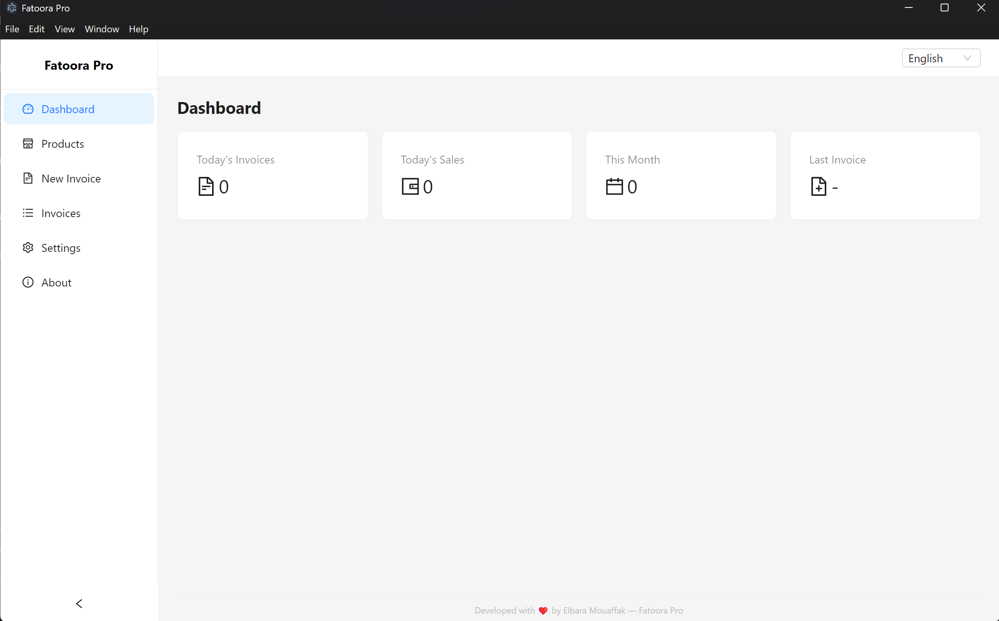
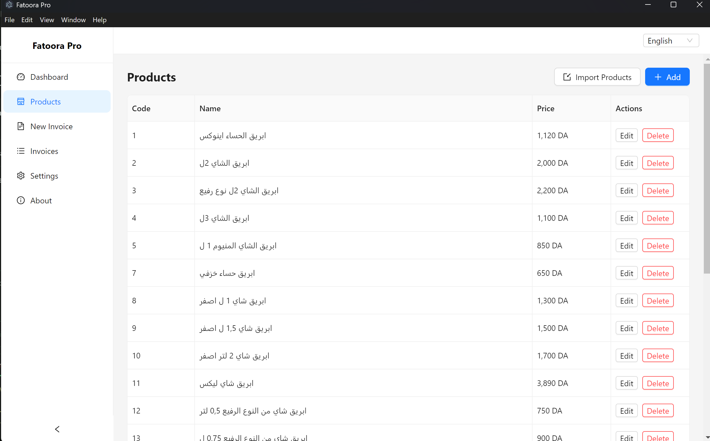
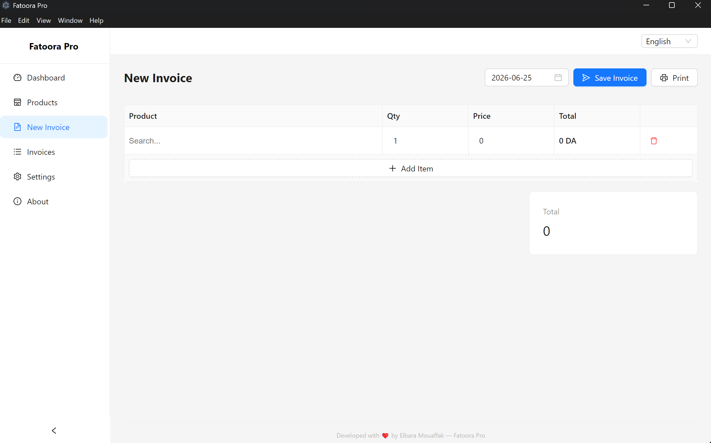
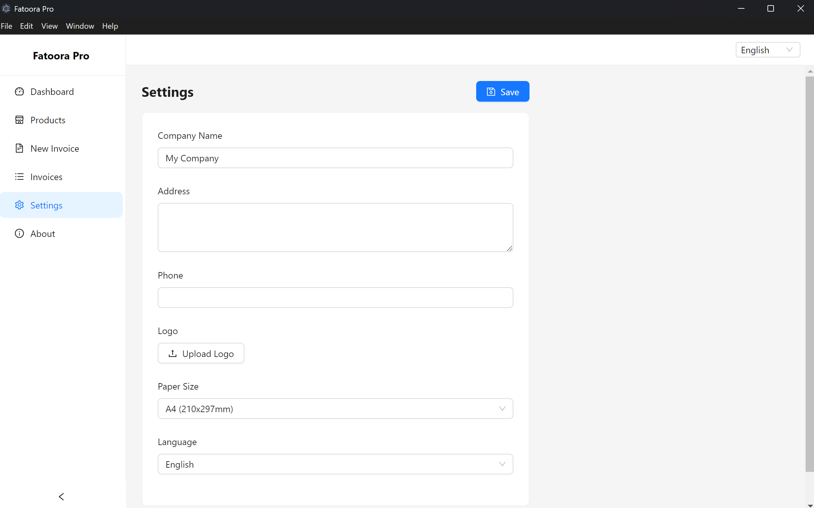
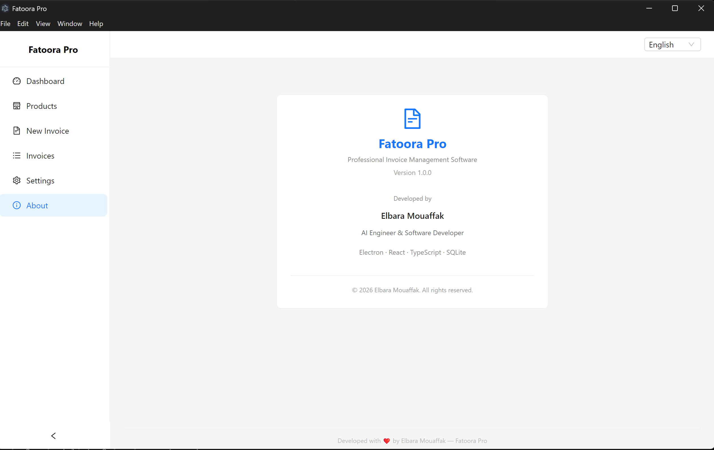

# Fatoora Pro

**Professional Invoice Management Desktop Application**

---

## Project Overview

A lightweight, offline-first desktop invoice generator built for small to medium wholesale businesses. Create, manage, and print invoices with a clean, modern interface. The application runs entirely on your machine — no internet connection required, no data sent to external servers.

---

## Features

- **Product Management** — Add, edit, delete products with auto-generated codes
- **CSV Import** — Bulk import products from CSV files via native file dialog
- **Invoice Creation** — Fast keyboard-driven invoice entry with product autocomplete
- **Invoice Editing** — Edit existing invoices with full item management
- **Invoice History** — Browse, search, preview, and reprint past invoices
- **Invoice Printing** — Professional A4 print output with proper page breaks
- **Dual Language** — Full English and Arabic (RTL) interface
- **SQLite Database** — Zero-configuration, single-file local storage
- **Electron Desktop** — Cross-platform desktop application (Windows, macOS, Linux)

---

## Screenshots

### Dashboard



### Products



### New Invoice



### Settings



### About



---

## Technology Stack

| Layer | Technology |
|---|---|
| **Desktop Shell** | Electron 32 |
| **Frontend** | React 18 |
| **Language** | TypeScript 5 |
| **UI Library** | Ant Design 5 |
| **Build Tool** | Vite (electron-vite) |
| **Database** | SQLite via better-sqlite3 |
| **Formatting** | dayjs (dates), csv-parse (import) |

---

## Installation

### Prerequisites

- [Node.js](https://nodejs.org/) v18 or later
- npm v9 or later

### Setup

```bash
git clone https://github.com/elbara99/Fatoora-Pro.git
cd Fatoora-Pro
npm install
```

> **Note**: `better-sqlite3` is a native module and must be rebuilt for Electron's Node.js runtime. The build step handles this automatically via `@electron/rebuild`.

---

## Development

```bash
npm run dev
```

This starts the Vite dev server and launches the Electron application in development mode with hot module replacement.

---

## Build

```bash
npm run build
```

Compiles the application for production. Output is written to the `out/` directory:
- `out/main/index.js` — Electron main process
- `out/preload/index.js` — Preload bridge script
- `out/renderer/` — Bundled React frontend

---

## Roadmap

### v1.0 — Current Release

- Core invoice management workflow
- Product management with auto-generated codes
- Invoice creation, editing, printing
- Bilingual interface (English / Arabic)
- SQLite local storage

### Upcoming

- **Backup & Restore** — Database export and import for data portability
- **Better Invoice Search** — Advanced filtering by date, amount, product
- **Settings Improvements** — Additional configuration options
- **Performance Improvements** — Optimized queries for large datasets

---

## Project Structure

```
Fatoora-Pro/
├── src/
│   ├── main/             # Electron main process
│   │   ├── database/     # SQLite connection & schema
│   │   ├── ipc/          # IPC handler registration
│   │   └── services/     # Business logic (products, invoices, etc.)
│   ├── preload/          # Preload bridge (contextBridge API)
│   └── renderer/         # React frontend
│       └── src/
│           ├── components/  # Reusable UI components
│           ├── i18n/        # Translation files (en, ar)
│           ├── pages/       # Application pages
│           ├── types/       # TypeScript type definitions
│           └── utils/       # Utility functions
├── docs/                 # Documentation
└── package.json
```

---

## Author

**Elbara Mouaffak**  
AI Engineer & Software Developer

- GitHub: [https://github.com/elbara99](https://github.com/elbara99)
- LinkedIn: [Add your LinkedIn URL]

---

## License

MIT License. See [LICENSE](LICENSE) for details.

---

<p align="center">© 2026 Elbara Mouaffak. All Rights Reserved.</p>
